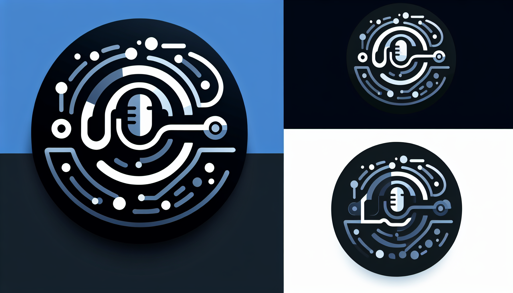
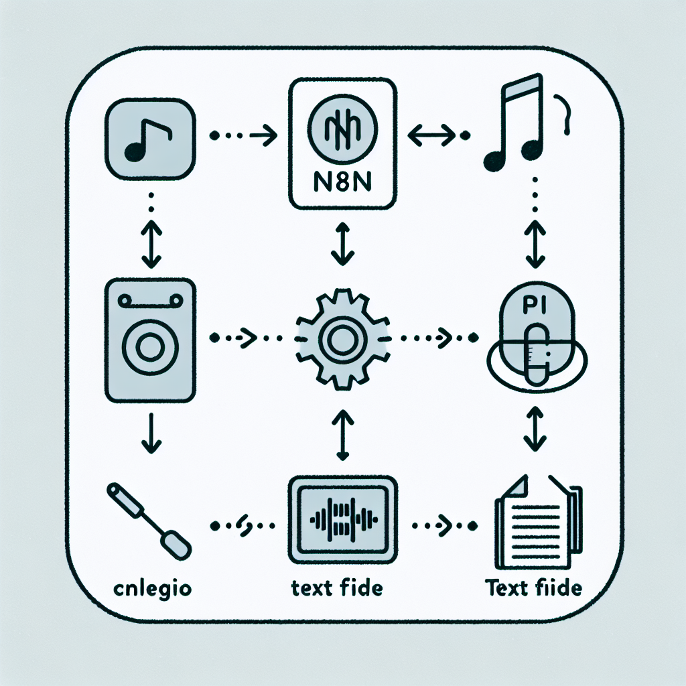

# n8n-nodes-deepgram

This is an n8n community node package for interacting with the [Deepgram](https://deepgram.com/) API.

It currently includes the following nodes:

*   **Deepgram Transcriber:** Transcribes pre-recorded audio files using the Deepgram API. Supports providing audio via URL or binary file input.
*   **Deepgram Speaker (TTS):** Generates audio from text using the Deepgram Speak API (Text-to-Speech).

[n8n](https://n8n.io/) is a fair-code licensed workflow automation platform.

[Installation](#installation)
[Operations](#operations)
[Credentials](#credentials)
[Compatibility](#compatibility)
[Usage](#usage)
[Resources](#resources)
[License](#license)

## Installation

Follow the [installation guide](https://docs.n8n.io/integrations/community-nodes/installation/) in the n8n community nodes documentation.

1.  Go to **Settings > Community Nodes**.
2.  Select **Install**.
3.  Enter `n8n-nodes-deepgram` in the **Enter package name** field.
4.  Agree to the risks of using community nodes: select **I understand the risks, and I want to proceed**.
5.  Select **Install**.

After installing the node, you can use it like any other node. n8n displays the node in the node panel under **Community** > **Installed**.

## Operations

*   **Deepgram Transcriber:**
    *   Transcribe audio from a public URL.
    *   Transcribe audio from an n8n binary file property.
    *   Supports various Deepgram models (including Nova 2 and Nova 3).
    *   Allows specifying additional options like language, punctuation, diarization, smart formatting, keywords, and callback URL.
    *   Optionally append metadata (endpoint, parameters, duration) to the output.
    *   Choose between outputting the full raw transcript or just the transcript text.
*   **Deepgram Speaker (TTS):**
    *   Convert input text (up to 2000 characters) into spoken audio.
    *   Select from various Deepgram Aura voice models.
    *   Configure audio output options like encoding (MP3, WAV, etc.), container, sample rate, and bit rate.
    *   Outputs the generated audio as an n8n binary file property.

## Credentials

Requires Deepgram API credentials. The same credentials work for both the Transcriber and Speaker nodes.

1.  Go to your [Deepgram Console](https://console.deepgram.com/).
2.  Navigate to **API Keys**.
3.  Create a new API key or use an existing one.
4.  In n8n, create new credentials for the Deepgram Transcriber node.
5.  Enter your Deepgram API Key.
6.  (Optional) If using a self-hosted or custom Deepgram endpoint, enter the Base URL.

## Compatibility

Tested with n8n version 1.x.

## Usage

1.  Install the package in your n8n instance.
2.  Add the **Deepgram Transcriber** node to your workflow.
3.  Configure the node properties:
    *   Select the **Input Source Type** (URL or Binary File).
    *   Provide the **Audio URL** or **Binary Property** name.
    *   Choose the desired **Model**.
    *   Configure **Additional Options** as needed (language, punctuate, etc.).
    *   Select the **Output Format**.
    *   If using "Transcript Only" format, optionally specify a custom **Transcript Field Name** (defaults to `transcript`).
4.  Connect the node and run your workflow.

### Deepgram Speaker (TTS)

1.  Install the package in your n8n instance.
2.  Add the **Deepgram Speaker (TTS)** node to your workflow.
3.  Configure the node properties:
    *   Enter the **Text to Speak**.
    *   Choose the desired **Voice Model**.
    *   Configure **Audio Options** (encoding, container, sample rate, bit rate) as needed.
    *   Specify the **Output Binary Property** name where the audio data will be stored (defaults to `data`).
    *   (Optional) Provide an **Output Filename** (e.g., `speech.mp3`). If left empty, a default filename based on the output format will be used (e.g., `deepgram_output.mp3`).
4.  Connect the node and run your workflow. The output item will contain the generated audio in the specified binary property, including the filename.

## Resources

*   [n8n Community Nodes documentation](https://docs.n8n.io/integrations/community-nodes/)
*   [Deepgram API Documentation](https://developers.deepgram.com/docs)
*   [GitHub Repository: Walid-Azur/n8n-nodes-deepgram](https://github.com/Walid-Azur/n8n-nodes-deepgram)

## Consulting & Services

For custom node development, workflow automation consulting, or other n8n-related services, please contact:

**Walid Boudabbous** (Acceleate Consulting Estonia)  
Email: [walid@acceleate.com](mailto:walid@acceleate.com)

## License

[MIT](LICENSE.md)
